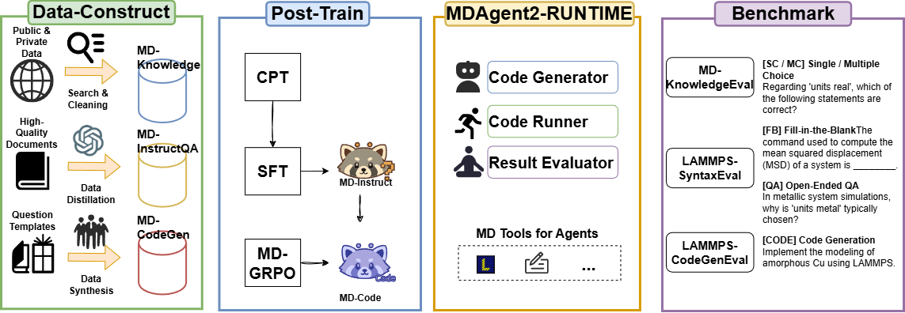
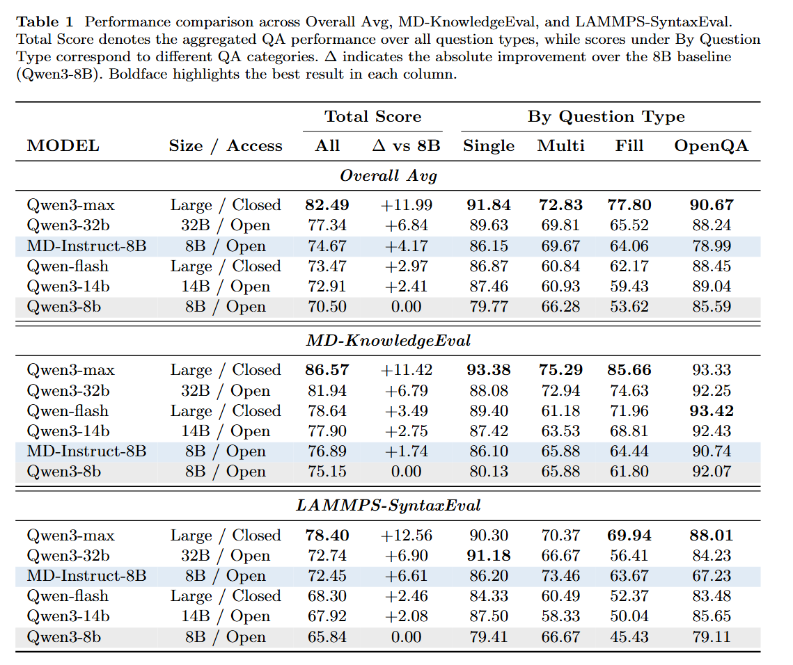
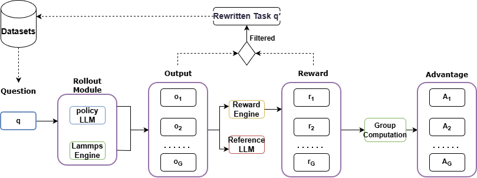
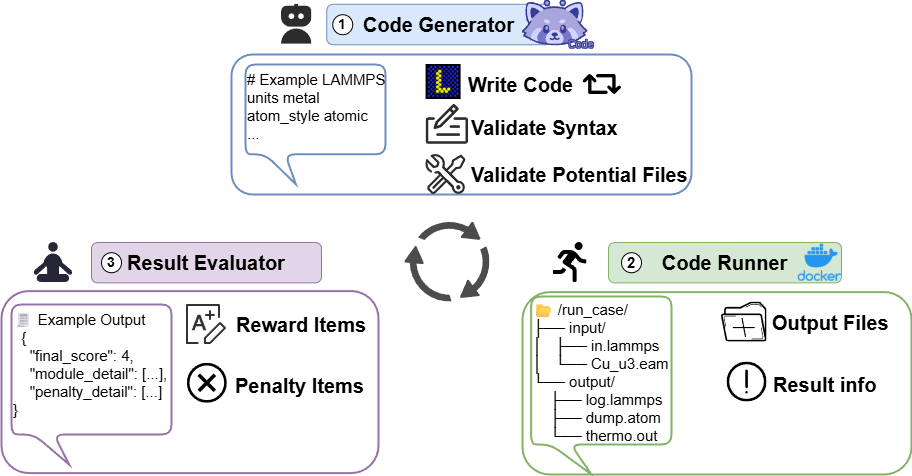

# MDAgent2: Large Language Model for Code Generation and Knowledge Q&A in Molecular Dynamics

<p align="center">
  
</p>

`<a href="https://arxiv.org/abs/2601.02075">``</a>`
`<a href="https://github.com/your-repo/PKU_MDAgent2">``</a>`
`<a href="https://your-username.github.io/PKU_MDAgent2/">``</a>`

> **Note:** Code and Datasets will be released upon paper acceptance.

## 💡 Introduction

- We present **MDAgent2**, the first end-to-end framework capable of performing both knowledge Q&A and code generation within the Molecular Dynamics (MD) domain.
- We construct a domain-specific data-construction pipeline that yields three high-quality datasets spanning MD knowledge, question answering, and code generation.
- We adopt a three-stage post-training strategy--continued pre-training (CPT), supervised fine-tuning (SFT), and reinforcement learning (RL)--to train two domain-adapted models, **MD-Instruct** and **MD-Code**.
- We introduce **MD-GRPO**, a closed-loop RL method that leverages simulation outcomes as reward signals and recycles low-reward trajectories for continual refinement.
- We build **MDAgent2-RUNTIME**, a deployable multi-agent system that integrates code generation, execution, evaluation, and self-correction.
- We propose **MD-EvalBench**, the first benchmark for LAMMPS code generation and question answering.

## 🚀 Performance

Our models and system achieve performance surpassing several strong baselines on MD-EvalBench, demonstrating the adaptability and generalization capability of large language models in industrial simulation tasks.

<p align="center">
  
</p>

<p align="center">
  
</p>

## 🔍 MDAgent2 Features

### Three-Stage Training Strategy

<p align="center">
  
</p>

MDAgent2 employs a comprehensive three-stage post-training strategy:

- **Continued Pre-training (CPT)**: Domain adaptation through continued pre-training on MD-specific corpus
- **Supervised Fine-tuning (SFT)**: Fine-tuning on high-quality instruction-following and code generation datasets
- **Reinforcement Learning (RL)**: MD-GRPO method for optimizing code generation with simulation feedback

### MD-GRPO: Closed-Loop Reinforcement Learning

<p align="center">
  
</p>

**MD-GRPO** is a novel closed-loop RL method that:

- Leverages simulation outcomes as reward signals for code quality assessment
- Recycles low-reward trajectories for continual refinement
- Enables iterative improvement of generated LAMMPS scripts

### MDAgent2-RUNTIME: Multi-Agent System

<p align="center">
  
</p>

**MDAgent2-RUNTIME** is a deployable multi-agent system that integrates:

- **Code Generation**: Automatic LAMMPS script generation from natural language descriptions
- **Code Execution**: Running generated scripts in simulation environments
- **Evaluation**: Assessing code correctness and simulation outcomes
- **Self-Correction**: Iterative refinement based on execution feedback

### Domain-Specific Datasets

We construct three high-quality datasets:

- **MD Knowledge Dataset**: Comprehensive knowledge base for molecular dynamics
- **Question Answering Dataset**: Q&A pairs for MD domain knowledge
- **Code Generation Dataset**: LAMMPS script examples with natural language descriptions

## 📊 MD-EvalBench

**MD-EvalBench** is the first benchmark for LAMMPS code generation and question answering, systematically evaluating:

- **Code Generation Tasks**: Generating executable LAMMPS scripts from natural language
- **Question Answering Tasks**: Answering domain-specific questions about molecular dynamics
- **Code Executability**: Ensuring generated code can run successfully in simulation environments

Experimental results show that MDAgent2 consistently surpasses representative baselines on MD-EvalBench.

## 🎯 Key Contributions

1. **First End-to-End Framework**: MDAgent2 is the first framework to support both knowledge Q&A and code generation in the MD domain
2. **Domain-Specific Data Pipeline**: High-quality dataset construction pipeline for MD domain
3. **Three-Stage Training**: Comprehensive training strategy combining CPT, SFT, and RL
4. **MD-GRPO Method**: Novel closed-loop RL approach leveraging simulation feedback
5. **Deployable System**: MDAgent2-RUNTIME for practical deployment
6. **First Benchmark**: MD-EvalBench for systematic evaluation

## 📑 Citation

If this work is helpful, please kindly cite as:

```bibtex
@misc{shi2026mdagent2large,
      title={MDAgent2: Large Language Model for Code Generation and Knowledge Q&A in Molecular Dynamics}, 
      author={Zhuofan Shi and Hubao A and Yufei Shao and Mengyan Dai and Yadong Yu and Pan Xiang and Dongliang Huang and Hongxu An and Chunxiao Xin and Haiyang Shen and Zhenyu Wang and Yunshan Na and Gang Huang and Xiang Jing},
      year={2026},
      eprint={2601.02075},
      archivePrefix={arXiv},
      primaryClass={cs.CE},
      url={https://arxiv.org/abs/2601.02075}
}
```

## 📝 License

This project is licensed under the terms specified in the LICENSE file.

## 🙏 Acknowledgments

We gratefully acknowledge support from all contributors and institutions involved in this research.
