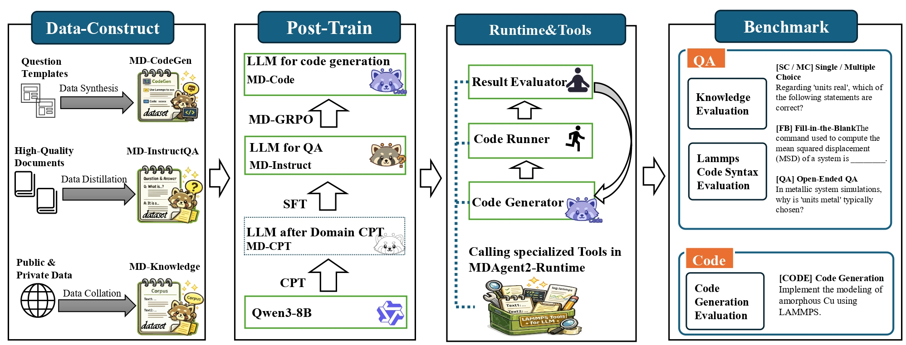
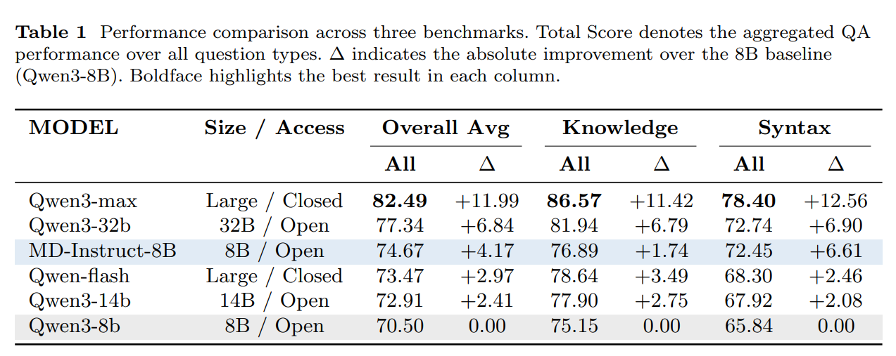
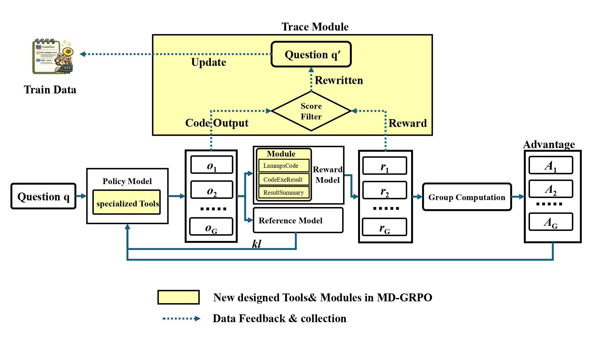
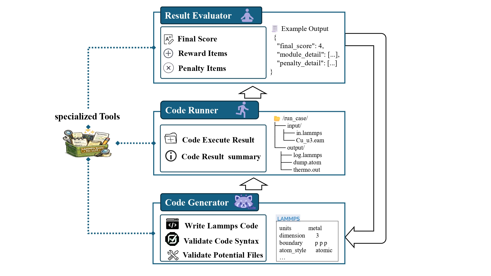

# MDAgent2: Large Language Model for Code Generation and Knowledge Q&A in Molecular Dynamics

<p align="center">
  
</p>

[](https://arxiv.org/abs/2601.02075)
[](https://github.com/FredericVAN/PKU_MDAgent2)
[](https://fredericvan.github.io/PKU_MDAgent2/)
[](https://huggingface.co/spaces/PKU-JX-LAB/Molecular-Dynamics-Benchmark)
[](https://huggingface.co/datasets/FredericFan/MD-EvalBench)

## News

> **Note:** Due to our future research and commercialization plans and related regulations, we have decided not to release the full code and complete benchmark before paper acceptance. At this stage, only partial code and a demo are available.

## Introduction

We present **MDAgent2**, the first end-to-end framework capable of performing both knowledge Q&A and code generation within the Molecular Dynamics (MD) domain. Our key contributions include:

- A domain-specific data-construction pipeline yielding three high-quality datasets spanning MD knowledge, question answering, and code generation.
- A three-stage post-training strategy — continued pre-training (CPT), supervised fine-tuning (SFT), and reinforcement learning (RL) — to train two domain-adapted models: **MD-Instruct** and **MD-Code**.
- **MD-GRPO**, a closed-loop RL method that leverages simulation outcomes as reward signals and recycles low-reward trajectories for continual refinement.
- **MDAgent2-RUNTIME**, a deployable multi-agent system integrating code generation, execution, evaluation, and self-correction.
- **MD-EvalBench**, the first benchmark for LAMMPS code generation and question answering.

## Performance

Our models and system surpass several strong baselines on MD-EvalBench, demonstrating the adaptability and generalization capability of LLMs in industrial simulation tasks.

<p align="center">
  
</p>

<p align="center">
  
</p>

## Architecture

### Three-Stage Training Strategy

<p align="center">
  
</p>

- **CPT**: Domain adaptation through continued pre-training on MD-specific corpus
- **SFT**: Fine-tuning on high-quality instruction-following and code generation datasets
- **RL (MD-GRPO)**: Closed-loop reinforcement learning using simulation feedback as reward signals, with low-reward trajectory recycling

### MD-GRPO

<p align="center">
  
</p>

### MDAgent2-RUNTIME

<p align="center">
  
</p>

A deployable multi-agent system integrating code generation, execution, evaluation, and self-correction in a closed loop.

## MD-EvalBench

**MD-EvalBench** is the first benchmark for LAMMPS code generation and question answering, evaluating:

- **Code Generation**: Generating executable LAMMPS scripts from natural language
- **Knowledge Q&A**: Answering domain-specific questions about molecular dynamics
- **Executability**: Ensuring generated code runs successfully in simulation environments

### Benchmark Data Decryption

To prevent benchmark data from being crawled for LLM training, answer fields in `MD_Benchmark/` are base64-encoded.

To decode the answer fields for evaluation:

```bash
python decrypt_benchmark.py
```

No password is needed. This restores the `answer` and `answer_text` fields in-place. The files remain valid JSON/JSONL throughout.

> **Note:** Please do not publicly redistribute the decoded benchmark data.

## How To Run

### Two Agent Implementations

**LangGraph Version**:

```python
from LammpsAgents_by_langgraph import run_lammps_agents

final_state = run_lammps_agents("Simulate the thermal expansion of copper", is_delete_dir=True)
```

**Autogen Version**:

```python
from LammpsAgents_by_autogen import run_lammps_agents

final_state = run_lammps_agents("Simulate the thermal expansion of copper", is_delete_dir=True)
```

### Environment Setup

#### Linux (Recommended)

1. Python 3.11 recommended (preferably via conda)
2. Install CUDA:

   ```bash
   conda install cudatoolkit cuda-version=11
   ```
3. Install LAMMPS:

   - **Option A** — conda (simple but limited):

     ```bash
     conda install lammps -c conda-forge
     conda install openkim-models -c conda-forge
     ```
   - **Option B** — Build from source (full control):

     ```bash
     git clone https://github.com/lammps/lammps.git
     cd lammps && mkdir build && cd build
     cmake ../cmake \
       -DCMAKE_BUILD_TYPE=Release \
       -DBUILD_MPI=ON \
       -DBUILD_SHARED_LIBS=ON \
       -DPKG_MISC=ON \
       -DPKG_KSPACE=ON \
       -DPKG_MOLECULE=ON \
       -DPKG_USER-MISC=ON \
       -DPKG_EAM=ON \
       -DPKG_MANYBODY=ON
     make -j$(nproc)
     ```
4. Install Python dependencies:

   ```bash
   pip install uv
   uv pip install -r requirements.txt
   ```
5. Configure environment variables:

   ```bash
   cp .env-EXAMPLE .env
   ```

   By default the agents use Alibaba **Tongyi/DashScope** models (`CODE_LLM_PROVIDER=tongyi`, model `qwen3-8b`/`qwen-flash`), so at minimum set:

   ```bash
   DASHSCOPE_API_KEY=<your DashScope API key>
   ```

   To use an OpenAI-compatible endpoint instead (OpenAI itself, Moonshot/Kimi, DeepSeek, etc.), switch the provider and point it at that endpoint, e.g.:

   ```bash
   CODE_LLM_PROVIDER=openai
   CODE_LLM_MODEL=kimi-k2-0711-preview
   OPENAI_API_KEY=<your API key>
   OPENAI_API_BASE=https://api.moonshot.cn/v1
   ```

   > If the run appears to hang with no output, it is almost always a missing/invalid API key for whichever provider is configured — double-check `CODE_LLM_PROVIDER`/`JUDGE_LLM_PROVIDER` in `.env` match the key you actually set (see [issue #2](https://github.com/FredericVAN/PKU_MDAgent2/issues/2)).
6. (Optional) Install PyTorch for local models:

   ```bash
   pip3 install torch torchvision torchaudio
   ```

#### Windows

1. Python 3.11 recommended (preferably via conda)
2. Install CUDA:

   ```bash
   conda install cudatoolkit cuda-version=11
   ```
3. Install LAMMPS following the [official guide](https://docs.lammps.org/Install.html)
4. Install Python dependencies:

   ```bash
   pip install uv
   uv pip install -r requirements.txt
   ```
5. Configure environment variables:

   ```bash
   cp .env-EXAMPLE .env
   ```

   By default the agents use Alibaba **Tongyi/DashScope** models (`CODE_LLM_PROVIDER=tongyi`, model `qwen3-8b`/`qwen-flash`), so at minimum set:

   ```bash
   DASHSCOPE_API_KEY=<your DashScope API key>
   ```

   To use an OpenAI-compatible endpoint instead (OpenAI itself, Moonshot/Kimi, DeepSeek, etc.), switch the provider and point it at that endpoint, e.g.:

   ```bash
   CODE_LLM_PROVIDER=openai
   CODE_LLM_MODEL=kimi-k2-0711-preview
   OPENAI_API_KEY=<your API key>
   OPENAI_API_BASE=https://api.moonshot.cn/v1
   ```

   > If the run appears to hang with no output, it is almost always a missing/invalid API key for whichever provider is configured — double-check `CODE_LLM_PROVIDER`/`JUDGE_LLM_PROVIDER` in `.env` match the key you actually set (see [issue #2](https://github.com/FredericVAN/PKU_MDAgent2/issues/2)).
6. (Optional) Install PyTorch:

   ```bash
   pip3 install torch torchvision torchaudio --index-url https://download.pytorch.org/whl/cu126
   ```

### Method 1: Frontend + Backend

- **Backend**: FastAPI — handles agent inference, file management, and visualization
- **Frontend**: Vue3 + Vite — interactive web interface

```bash
# Start backend (default port 8000)
python app.py

# Start frontend
cd lammps-frontend
npm install
npm run dev
```

Frontend: [http://localhost:5173](http://localhost:5173) | Backend API docs: [http://localhost:8000/docs](http://localhost:8000/docs)

### Method 2: Docker

```bash
# Build
docker build -t lammps-grpo:latest .

# Run
docker run -d --restart=always -p 8000:8000 \
  --env-file .env \
  --name lammps-grpo \
  lammps-grpo:latest
```

> The default image uses `python:3.11-slim` without GPU/CUDA. Extend the Dockerfile if you need LAMMPS with CUDA inside the container.

## Examples

**Input**:

> Simulate the thermal expansion coefficient of copper at 300K under NPT conditions, and output its volume change data.

**Generated LAMMPS Script**:

```lammps
units metal
atom_style atomic
lattice fcc 3.615
region box block 0 5 0 5 0 5
create_box 1 box
create_atoms 1 box
mass 1 63.546
pair_style eam
pair_coeff * * potentials/Cu_u3.eam
velocity all create 300.0 12345
log log.lammps
dump 1 all atom 10 dump.lammpstrj
dump_modify 1 sort id
thermo 10
fix 1 all npt temp 300.0 300.0 0.1 iso 0 0 1.0
run 1000
```

## Directory Structure

```text
├── LammpsAgents_by_langgraph.py   # Agent workflow based on LangGraph
├── app.py                         # FastAPI backend service
├── prompt.py                      # System prompts for LAMMPS generation
├── encrypt_benchmark.py           # Encode benchmark answer fields (base64)
├── decrypt_benchmark.py           # Decode benchmark answer fields
├── potentials/                    # LAMMPS potential files
├── train_dataset/                 # Training datasets (examples only)
│   ├── MD-CodeGen/
│   ├── MD-InstructQA/
│   └── MD-Knowledge/
├── MD_Benchmark/                  # Evaluation benchmark
│   ├── ZH/                       # Chinese version
│   │   ├── Code_Eval/
│   │   └── QA_Eval/
│   └── EN/                       # English version
│       ├── Code_Eval/
│       └── QA_Eval/
├── utils/                         # Utilities and APIs
├── lammps-frontend/               # Vue3 frontend
├── lammps_run_example/            # Example LAMMPS outputs
├── pics/                          # Figures
├── demo_video/                    # Demo video
├── requirements.txt               # Python dependencies
├── requirements_grpo.txt          # GRPO training dependencies
├── Dockerfile                     # Docker configuration
├── .env-EXAMPLE                   # Environment variables template
├── README.md                      # Documentation (English)
├── README_CN.md                   # Documentation (Chinese)
└── LICENSE                        # License
```

## Citation

If this work is helpful, please cite:

```bibtex
@misc{shi2026mdagent2large,
      title={MDAgent2: Large Language Model for Code Generation and Knowledge Q&A in Molecular Dynamics}, 
      author={Zhuofan Shi and Hubao A and Yufei Shao and Mengyan Dai and Yadong Yu and Pan Xiang and Dongliang Huang and Hongxu An and Chunxiao Xin and Haiyang Shen and Zhenyu Wang and Yunshan Na and Gang Huang and Xiang Jing},
      year={2026},
      eprint={2601.02075},
      archivePrefix={arXiv},
      primaryClass={cs.CE},
      url={https://arxiv.org/abs/2601.02075}
}
```

## License

This project is licensed under the terms specified in the [LICENSE](LICENSE) file.

## Acknowledgments

We gratefully acknowledge support from all contributors and institutions involved in this research.
